- # Contratos 
    - ## Consultar
        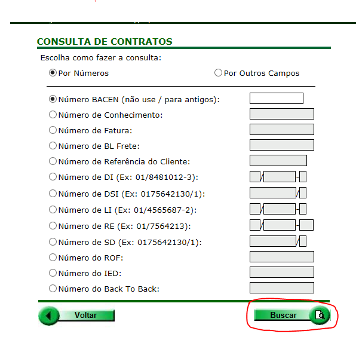
        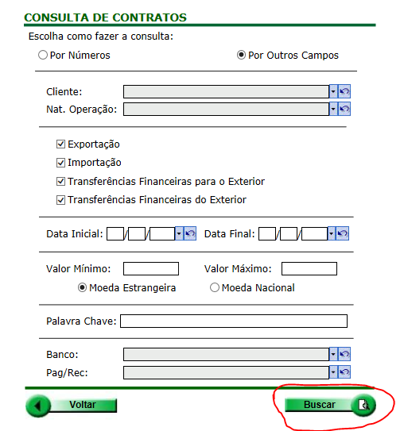
        - ### **ContratosBusca**() 
            > 1. Numero *ou* NumeroBACEN  
            > 1. Natureza  
            > 2. DataRange
            > 3. ValorMoedaNacional *(ValorMNMin e ValorMNMax)* 
            > 3. ValorMoedaEstrangeira *(ValorMEMinMin & ValorMEMax)*  
            > 4. ClienteId *(SecurityInfo)*
            > 5. GrupoID  
            > 6. BancoID  
            > 7. PagadorRecebedorId  
            > 8. Tipo {exportação, importação, TransfparaExt, TransfdoExt}  
            > 9. OutrasEspecificações (Palavra-Chave) 

        - ### **ContratosPorConhecimento**()
            > 1. Conhecimento 
            > 1. ClienteId *(SecurityInfo)*

        - ### **ContratosPorFatura**()
            > 1. Fatura  
            > 1. ClienteId *(SecurityInfo)*

        - ### **ContratosPorBL**()
            > 1. BL  
            > 1. ClienteId *(SecurityInfo)*

        - ### **ContratosPorReferencia**()
            > 1. Referencia   
            > 1. ClienteId *(SecurityInfo)*

        - ### **ContratosPorDI**()
            > 1. DI  
            > 1. ClienteId *(SecurityInfo)*

        - ### **ContratosPorDSI**()
            > 1. DSI  
            > 1. ClienteId *(SecurityInfo)*

        - ### **ContratosPorLI**()
            > 1. LI  
            > 1. ClienteId *(SecurityInfo)*

        - ### **ContratosPorRE**()
            > 1. RE  
            > 1. ClienteId *(SecurityInfo)*

        - ### **ContratosPorSD**()
            > 1. SD  
            > 1. ClienteId *(SecurityInfo)*

        - ### **ContratosPorROF**()
            > 1. ROF  
            > 1. ClienteId *(SecurityInfo)*

        - ### **ContratosPorIED**()
            > 1. IED  
            > 1. ClienteId *(SecurityInfo)*

        - ### **ContratosPorBackToBack**()
            > 1. BackToBack   
            > 1. ClienteId *(SecurityInfo)*
        
        > 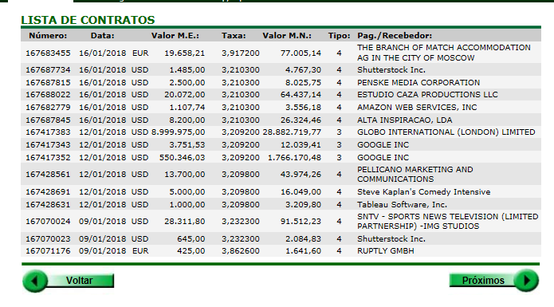
        
        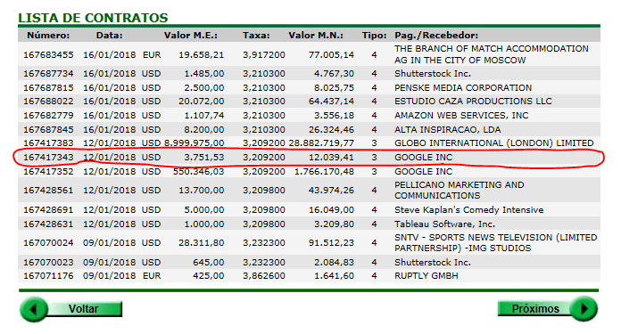
        - ### **ProCam.WebControls.Operador** ContratoDetail()
            > 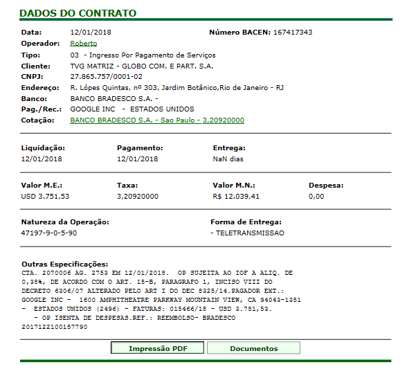

        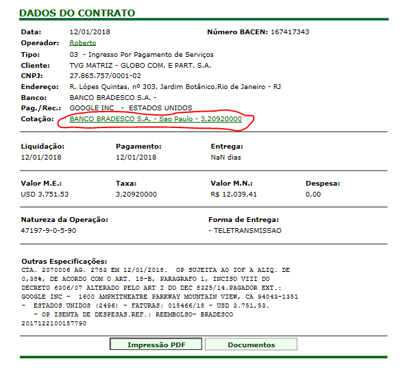
        - ### **ProCam.WebControls.ValorFechadoCotacao** CotacaoContrato()
            > 1. CotacaoContratoId
            > 2. ItemCotacaoContratoId
            >
            > 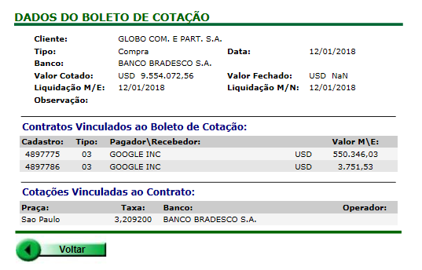

        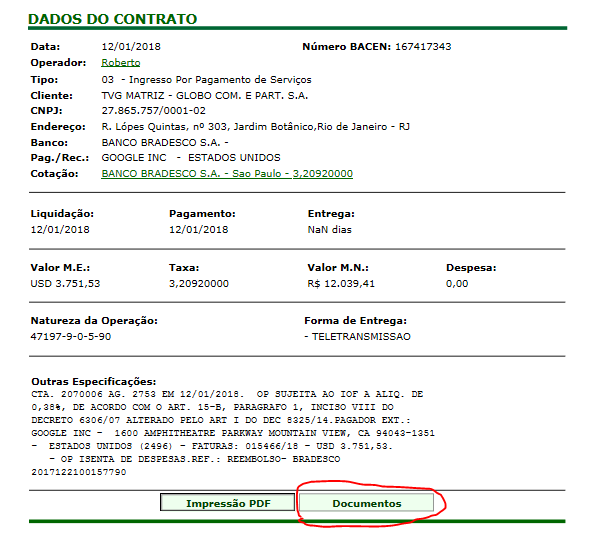
        - ### **ObterAnexosContrato**()
            > 1. ContratoId
            > 
            > 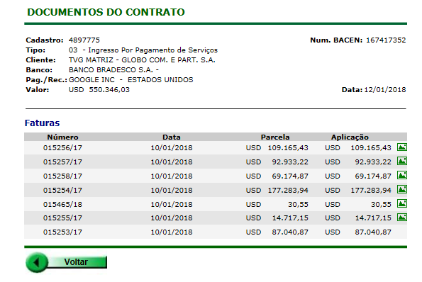
        
        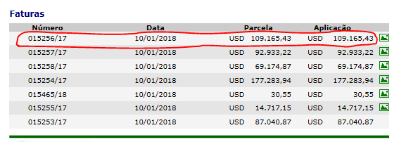
        - ### **RedirecionarAplicacoesDocumento**()
            > 1. AplicacaoId
            >
            > 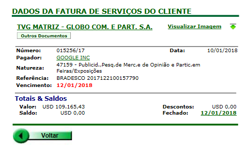

        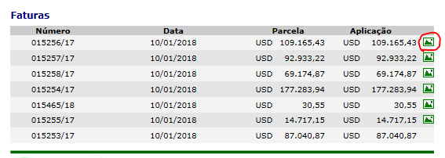
        - ### **VisualizarImagemController** VisualizarArquivo()
            > 1. ArquivoId

    - ## Autorização de Contratação – Exp. C/ACC
        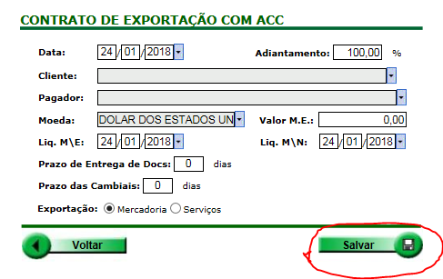
        - ### **CriarContratoACCCambioOn**(Contrato, TipoExportação)            
            > 1. Data
            > 3. Adiantamento
            > 4. Cliente
            > 5. PagadorRecebedor
            > 6. Moeda
            > 7. ValorMoedaEstrangeira
            > 8. LiquidacaoMoedaEstrangeira
            > 9. LiquidacaoMoedaNacional
            > 10. PrazoEntrega
            > 10. PrazoCambial
            > * TipoExportação: *Mercadorias ou Serviços*

    - ## Cotações.PNG
        
        - ### **CotacoesContratoUsuario**() 
            > 1. DataRange
            > 1. ClienteId *(SecurityInfo)*
            >
            > 
        
        
        - ### **ProCam.WebControls.ValorFechadoCotacao** CotacaoContrato()
            > 1. CotacaoId
            >
            > 

- # Corretagem 
    - ## Consulta de boletos.PNG
        
        - ### **Boletos**()
            > 1. NumeroBanco 
            > 2. ClienteId *(SecurityInfo)*
            > 3. DataInicial
            > 4. DataFinal

        - ### **BoletosPorNotaFiscal**()
            > 1. NotaFiscal
            > 1. ClienteId *(SecurityInfo)*

        > 
        
        
        
        
    - ## Consulta de notas fiscais.PNG
        
        - ### **NotasFiscais**()
            > 1. Numero 
            > 2. ClienteId *(SecurityInfo)*
            > 3. DataInicial
            > 4. DataFinal

        - ### **NotasFiscaisPorContrato**()
            > 1. NumeroBACEN
            > 1. ClienteId *(SecurityInfo)*
        
        > 

        
        - ### **NotaFiscalDetail**()
            > 1. NotaFiscalId
            >
            > 

        
        - ### [ContratoDetail()](#ProCam.WebControls.Operador-ContratoDetail)
            > 

        
        - ### **ContratosPorNotaFiscal**()
            > 

    - ## Relatório de corretagem por período.PNG
        
        - ### **CorretagemPorCliente**()
            > 1. DataRange
            > 3. ClienteId *(SecurityInfo)*
            >
            > 

- # Tesouraria 
    - ## Contas a pagar.PNG
        
        - ### **ConsolidadoPorMes**()
            > 1. ClienteId *(SecurityInfo)*
            > 2. PagRecId
            > 3. TipoOpId (tipoOperacao)
            > 4. DataRange
            >
            > 
        
        
        - ### **ConsolidadoPorDia**()
            > 1. MesI
            > 2. AnoI
            > 3. DiaI
            > 4. MesF
            > 5. AnoF
            > 6. DiaF
            > 7. tipoOpId
            > 8. ClienteId *(SecurityInfo)*
            > 9. pagRecId
            > 10. dia
            
        - ### **ConsolidadoPorCliente**()
            > 1. MesI
            > 2. AnoI
            > 3. DiaI
            > 4. MesF
            > 5. AnoF
            > 6. DiaF
            > 7. tipoOpId
            > 8. ClienteId *(SecurityInfo)*
            > 9. pagRecId
            > 10. dia

        - ### **ConsolidadoPorPagadorRecebedor**()
            > 1. MesI
            > 2. AnoI
            > 3. DiaI
            > 4. MesF
            > 5. AnoF
            > 6. DiaF
            > 7. tipoOpId
            > 8. ClienteId *(SecurityInfo)*
            > 9. pagRecId
            > 10. dia
            > 11. BL

        - ### **ConsolidadoFinanceiro**()
            > 1. MesI
            > 2. AnoI
            > 3. DiaI
            > 4. MesF
            > 5. AnoF
            > 6. DiaF
            > 7. tipoOpId
            > 8. ClienteId *(SecurityInfo)*
            > 9. pagRecId
            > 10. dia
            > 11. BL

        > 

        
        - ### **FaturaJurosRecebedor**()
            > 1. DocumentoId

        - ### **FaturaServicosRecebedor**()
            > 1. DocumentoId
            
        - ### **BoletoSeguro**()
            > 1. DocumentoId

        - ### **BL**()
            > 1. DocumentoId

        > 

    - ## Contas a receber.PNG
        - ### **ConsolidadoAReceberPorMes**()
            > 1. ClienteId *(SecurityInfo)*
            >
            > 
            > 

        
        - ### **ConsolidadoPorDia**()
            > 1. Mes
            > 2. Ano
            > 1. ClienteId *(SecurityInfo)*
            > 
            > 

        
        - ### **ConsolidadoPorCliente**()
            > 1. Mes
            > 2. Ano
            > 1. ClienteId *(SecurityInfo)*
            > 
            > 

        
        - ### **ConsolidadoAReceberFinanceiro**()
            > 1. Mes
            > 2. Ano
            > 1. ClienteId *(SecurityInfo)*
            > 
            > 

        
        - ### **ConsolidadoExportacao**()
            > 1. Mes
            > 2. Ano
            > 1. ClienteId *(SecurityInfo)*

        
        - ### **FaturaServicosRecebedor**()
            > 1. DocumentoId   

        
        - ### **ConsolidadoPorCliente**()
            > 1. ClienteId *(SecurityInfo)*
            > 
            > 
             
    - ## Back o back
        - ### **listarBackToBacksPendentes**()
            > 1. Pendente
            > 1. ClienteId *(SecurityInfo)*
        
        - ### **listarporbacktoback**()
            > 1. PagadorRecebedorId
            > 2. DataRange
            > 3. BackToBack
            > 4. TipoOpId
            > 5. ClienteId *(SecurityInfo)*

        - ### **BackToBackConsolidadoPorMes**()
            > 1. ClienteId *(SecurityInfo)*

        - ### **BackToBackConsolidadoPorDia**()
            > 1. Mes
            > 1. Ano
            > 1. ClienteId *(SecurityInfo)*

        - ### **BackToBackConsolidadoPorOperacao**()
            > 1. Mes
            > 1. Ano
            > 1. Dia
            > 1. ClienteId *(SecurityInfo)*

        - ### **BackToBackConsolidadoExportacao**()
            > 1. Mes
            > 1. Ano
            > 1. Dia
            > 1. ClienteId *(SecurityInfo)*

        - ### **BackToBackConsolidadoImportacao**()
            > 1. Mes
            > 1. Ano
            > 1. Dia
            > 1. ClienteId *(SecurityInfo)*

- # Importação/Exportação 
    - ## Importação
        - ### **DadosModuloImportacaoConsolidado**()
            > 1. ClienteId *(SecurityInfo)*
    
    - ## Exportação
        - ### **DadosModuloExportacao**()
            > 1. ClienteId *(SecurityInfo)*

- # Documentos 
    - ## Consultar
        - ### **FaturasMercadoriaRecebedor**()
            > 1. Referencia
            > 2. PagRecId
            > 3. Numero
            > 4. Vencimento (DataRange)
            > 5. PurchaseOrder
            > 6. Processo
            > 1. ClienteId *(SecurityInfo)* 

        - ### **FaturasProFormaRecebedor**()
            > 1. Referencia
            > 2. PagRecId
            > 3. Numero
            > 4. Vencimento (DataRange)
            > 5. PurchaseOrder
            > 1. ClienteId *(SecurityInfo)*

        - ### **FaturasServicosRecebedor**()
            > 1. Referencia
            > 2. PagRecId
            > 3. Numero
            > 4. Vencimento (DataRange)
            > 5. PurchaseOrder
            > 1. ClienteId *(SecurityInfo)*

        - ### **FaturasJurosRecebedor**()
            > 1. Referencia
            > 2. PagRecId
            > 3. Numero
            > 4. Vencimento (DataRange)
            > 5. PurchaseOrder
            > 1. ClienteId *(SecurityInfo)*

        - ### **FaturasMercadoriaCliente**()
            > 1. Referencia
            > 2. PagRecId
            > 3. Numero
            > 4. Vencimento (DataRange)
            > 6. Mercadoria
            > 1. ClienteId *(SecurityInfo)*

        - ### **FaturasProFormaCliente**()
            > 1. Referencia
            > 2. PagRecId
            > 3. Numero
            > 4. Vencimento (DataRange)
            > 1. ClienteId *(SecurityInfo)*

        - ### **FaturasServicosCliente**()
            > 1. Referencia
            > 2. PagRecId
            > 3. Numero
            > 4. Vencimento (DataRange)
            > 1. ClienteId *(SecurityInfo)*

        - ### **FaturasJurosCliente**()
            > 1. Referencia
            > 2. PagRecId
            > 3. Numero
            > 4. Vencimento (DataRange)
            > 1. ClienteId *(SecurityInfo)*

        - ### **FaturasJurosCliente**()
            > 1. Referencia
            > 2. PagRecId
            > 3. Numero
            > 4. Vencimento (DataRange)
            > 1. ClienteId *(SecurityInfo)*

        - ### **DIs**()
            > 1. Referencia
            > 2. PagRecId
            > 3. Numero
            > 4. Vencimento (DataRange)
            > 1. ClienteId *(SecurityInfo)*

        - ### **LIs**()
            > 1. Referencia
            > 3. Numero
            > 4. DataFechamento (DataRange)
            > 1. ClienteId *(SecurityInfo)*

        - ### **REs**()
            > 1. Referencia
            > 3. Numero
            > 4. Vencimento (DataRange)
            > 1. ClienteId *(SecurityInfo)*

        - ### **SDs**()
            > 1. Referencia
            > 3. Numero
            > 1. ClienteId *(SecurityInfo)*

        - ### **DSEs**()
            > 1. Referencia
            > 3. Numero
            > 4. Vencimento (DataRange)
            > 1. ClienteId *(SecurityInfo)*

        - ### **ROFs**()
            > 1. Referencia
            > 3. Numero
            > 1. ClienteId *(SecurityInfo)*

        - ### **IEDs**()
            > 1. Referencia
            > 3. Numero
            > 1. ClienteId *(SecurityInfo)*

        - ### **DSIs**()
            > 1. Referencia
            > 3. Numero
            > 4. Vencimento (DataRange)
            > 1. ClienteId *(SecurityInfo)*

        - ### **BoletosSeguro**()
            > 1. Referencia
            > 3. Numero
            > 4. Vencimento (DataRange)
            > 1. ClienteId *(SecurityInfo)*

        - ### **BLImportacao**()
            > 1. Referencia
            > 3. Numero
            > 3. PagadorRecebedorId
            > 4. Vencimento (DataRange)
            > 1. ClienteId *(SecurityInfo)*

        - ### **BLExportacao**()
            > 1. Referencia
            > 3. Numero
            > 3. PagadorRecebedorId
            > 4. Vencimento (DataRange)
            > 1. ClienteId *(SecurityInfo)*

        - ### **Conhecimentos**()
            > 1. Referencia
            > 3. Numero
            > 3. Transportadora
            > 4. Navio
            > 1. ClienteId *(SecurityInfo)*

        - ### **BackToBacks**()
            > 1. Referencia
            > 3. Numero
            > 1. ClienteId *(SecurityInfo)*

    - ## A autorizar
        - ### **ParcelasAAutorizarPorCliente**()
            > 1. ClienteId *(SecurityInfo)*

    - ## Pendentes
        - ### **DocumentosPendentesPorCliente**()
            > 1. ClienteId *(SecurityInfo)*
 
- # Relatórios 
    - ## Remessa de Serviço
        - ### **ListaRemessaServicoController** Consultar()
            > 1. ClienteId *(SecurityInfo)*
            > 2. dataInicial
            > 3. dataFinal

    - ## Customizado
         -  ### Solicitar  -  **CustomizadoController** Consultar()
            > 1. tipoTransferenciaDoExterior
            > 2. tipoExportacao
            > 3. tipoTransferenciaParaExterior
            > 1. tipoImportacao
            > 1. isME
            > 2. rdeId
            > 3. naturezaId
            > 4. natOpGrupoId
            > 5. moedaId
            > 6. PagadorReceberdorId
            > 7. bancoId
            > 8. clienteId *(SecurityInfo)*
            > 9. usuarioid
            > 10. grupoId
            > 1. cnpj_cpf  

         -  ### Solicitações Realizadas - ***DocumentTransferStatusController** ??*

    - ## Operações Sujeitas a DIRF
         -  ###  Solicitar -  **ReceitaController** Consultar()
            > 1. cnpj_cpf
            > 2. clienteId *(SecurityInfo)*
            > 3. dataInicial
            > 4. dataFinal  

         -  ### Solicitações Realizadas - ***DocumentTransferStatusController** ??*

    - ## Documentos
        <!--  -->
        - ### Fechados - **ProCamReports.GerenteRelatorios** GerarPlanilhaCambio()
            > 1. ClienteId
            > 2. datInicio
            > 3. datFim
            > 4. chkExportacao
            > 5. chkImportacao
            > 5. chkFinCompra
            > 6. chkFinVenda

    - ## Back To Back
        - ### Câmbios Contratados - **ProCamReports.GerenteRelatorios** GerarPlanilhaCambioBackToBackContratado()
            > 1. ClienteId
            > 2. datInicio
            > 3. datFim

        - ### Câmbios a contratar - **ProCamReports.GerenteRelatorios** GerarPlanilhaCambioBackToBackAContratar()
            > 1. ClienteId
   
    - ## Contas a Pagar
        - ### Documentos a Pagar - **ProCamReports.GerenteRelatorios** - GerarPlanilhaDocumentosContasAPagarDetalhado()
            > 1. clienteId
            > 2. naturezaOperacao
            > 2. pagadorRecebedor
            > 3. datInicio
            > 3. datFim
            > 3. datVencInicio
            > 5. datVencFim

        - ### Documentos a Pagar DI - **ProCamReports.GerenteRelatorios** - GerarPlanilhaDocumentosContasAPagarDetalhadoDI()
            > 1. clienteId
            > 2. naturezaOperacao
            > 2. pagadorRecebedor
            > 3. datInicio
            > 3. datFim
            > 3. datVencInicio
            > 5. datVencFim
            > 5. fatura

        - ### Documentos Fechados - **ProCamReports.GerenteRelatorios** - GerarPlanilhaDocumentosContasAPagarPosFechamentoDetalhado()
            > 1. clienteId
            > 2. naturezaOperacao
            > 2. pagadorRecebedor
            > 5. banco 
            > 3. datInicio
            > 3. datFim
            > 3. datVencInicio
            > 5. datVencFim
  
    - ## Contas a Receber
        - ### **ProCamReports.GerenteRelatorios** - GerarPlanilhaContasAReceber()
            > 1. clienteId
            > 2. naturezaOperacao
            > 2. pagadorRecebedor
            > 3. datInicio
            > 3. datFim
            > 4. moeda
    
- # Administração
    - ## Usuários
        - ### Cadastrar - **CadastrarUsuarioBaseController** CriarUsuarioCambion()
            > 1. userName
            > 2. email
            > 3. login
            > 3. password
            > 4. passwordConfirmation
            > 5. clienteId

        - ### Consultar - **UsuariosPorSecInfo**()
            > 1. CurrentUserId *(SecurityInfo)*
    
    - ## Pags/Recs
        - ### **ClientesPagadoresRecebedores**()
            > 1. ClienteId
            > 1. CurrentUserId *(SecurityInfo)*
 

  